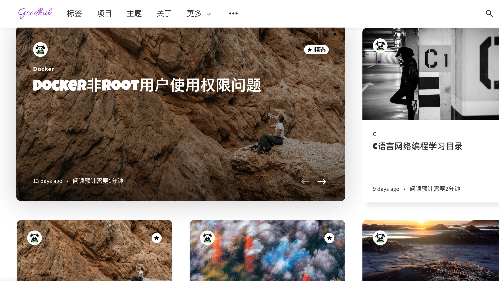

[English Version](./README.md)
# Liebling

Liebling 是一个非常的简洁漂亮容易上手使用的Ghost主题。最最重要的是**它是免费的**，欢迎使用 🌓!

## Ghost 5

目前我是在Ghost 5.48上使用的本主题。Ghost4及之前的版本，请使用以前的[老版本](https://github.com/eddiesigner/liebling/releases/tag/v1.5.2)。

## Preview

可以去我的博客地址参观效果[https://goodhub.cn](https://goodhub.cn)，或者去原主题demo网站观赏[https://liebling.eduardogomez.io](https://liebling.eduardogomez.io)

  

## Download

下载最新的版本[releases](https://github.com/mjackie946/liebling/releases)。

## Documentation

查看原仓库中的使用教程[Wiki](https://github.com/eddiesigner/liebling/wiki).

## 特点

### 常规特点

* 干净美观的设计
* 极速响应
* 轻巧高效
* 完全响应式，适配任何设备
* 兼容现代浏览器

### Ghost 特点

* 订阅表单
* 多位作者支持
* Logo 支持
* 次级菜单
* 强调色彩
* 精选文章和页面
* 文章、页面、标签、作者、页面等
* Koenig 编辑器
* 书签卡片
* 图库卡片
* 按钮卡片
* NFT 卡片
* 引用
* 切换
* 引用
* 产品
* 音频
* 视频
* 文件上传
* 头部
* 博客标题和描述
* 首页、文章、页面、标签、作者页面的封面图片
* 作者头像、简介、位置、网站和社交链接
* Facebook 和 Twitter 的社交链接
* 阅读时间
* 前后文章导航
* 文章的主要标签

### Liebling 独特特点

* 暗黑模式
* 搜索功能
* 自定义设置
* 自定义订阅页面
* 自定义作者页面
* 自定义错误页面
* Medium 风格的图片缩放
* Disqus 评论功能
* 在 Facebook 和 Twitter 上分享文章
* 特色文章的幻灯片
* 支持文章中的普通、宽幅和全图像
* 阅读进度指示器
* RTL 语言支持
* 文章页面支持目录列表

## 本地化

* English
* Spanish
* German by [D3473R](https://github.com/D3473R)
* Informal german by [D3473R](https://github.com/D3473R)
* Bulgarian by [clappingmonkey](https://github.com/clappingmonkey)
* Vietnamese by [hiensarahly](https://github.com/hiensarahly)
* Italian by [vignini](https://github.com/vignini)
* French by [v1nc3nt-fr](https://github.com/v1nc3nt-fr)
* Informal french by [v1nc3nt-fr](https://github.com/v1nc3nt-fr)
* Portuguese by [ivomota](https://github.com/ivomota)
* Arabic by [allamiro](https://github.com/allamiro)
* Polish by [otlet](https://github.com/otlet)
* Brazilian portuguese by [pedrinholula](https://github.com/pedrinholula)
* Russian by [stereohorse](https://github.com/stereohorse)
* Kyrgyz by [januchaos](https://github.com/januchaos)
* Hebrew by [cohen604](https://github.com/cohen604)
* Turkish by [mskoroglu](https://github.com/mskoroglu)
* Romanian by [dsecareanu](https://github.com/dsecareanu)
* Chinese Simplified by [IvyB](https://github.com/IvyB), [mjackie946](https://github.com/mjackie946)
* Indonesian by [iqbalbinsb](https://github.com/iqbalbinsb), [khannedy](https://github.com/khannedy)
* Lithuanian by [pintom](https://github.com/pintom)
* Dutch by [Qballjos](https://github.com/Qballjos)
* Traditional Chinese by [weixiang](https://github.com/weixiang)
* Persian (Farsi) by [Aminoiz](https://github.com/Aminoiz)
* Ukrainian by [partizan007](https://github.com/partizan007)
* Kazakh by [arshyn-t](https://github.com/arshyn-t)
* Korean by [chocosobo](https://github.com/chocosobo)
* Japanese by [ViaSnake](https://github.com/ViaSnake)
* Czech by [Fjuro](https://github.com/Fjuro)
* Swedish by [momeenme](https://github.com/momeenme)
* Slovak by [jjuris](https://github.com/jjuris)
* Thai by [Parinya T.](https://github.com/pickyzz)

## 测试

* W3C标记验证: [正确验证](https://validator.w3.org/nu/?doc=https%3A%2F%2Fliebling.eduardogomez.io%2F)
* Ghost GScan: [100/100 分](https://gscan.ghost.org/)
* GTmetrix PageSpeed得分: **A (97%)**
* PageSpeed Insights: **94/100** (mobile) **99/100** (desktop)
* Pingdom性能等级: **A 91**

## 主题开发

感谢 [D3473R](https://github.com/D3473R) 💪创建了一个带有Docker的开发环境。从现在开始，您可以在本地计算机上安装Ghost实例而无需担心。只需两个命令，您就可以即时建立开发环境，并为主题构建生产环境。

请查看此页面了解其工作原理：https://github.com/eddiesigner/liebling/wiki/Theme-development-with-Docker

## 帮助与支持

如果您对此产品有任何问题或困扰，请随时在此处提交问题 [here](https://github.com/mjackie946/liebling/issues).

## 贡献

非常欢迎贡献。请访问[Goodhub](https://goodhub.cn)，订阅。

## 相关

* [Galerie](https://eddiesigner.gumroad.com/l/KgroF) - 现代多功能主题，以其简洁设计脱颖而出，速度快，用户体验佳，并提供多种自定义选项。

* [Firma](https://gum.co/ZXLha) - 适用于初创公司到大公司的Ghost主题，可发布与业务相关的各种文章。以其清晰的设计脱颖而出，并能够适应任何公司的形象。

* [Weiss Pro](https://gum.co/pzvDn) - 现代美观的Ghost主题，为您的内容增添光彩。

## 许可证

版权所有 (c) 2019-present Eduardo Gómez。根据 [MIT license](https://github.com/eddiesigner/liebling/blob/master/LICENSE) 发布.

## 致谢

本主题中使用的所有照片均来自[Unsplash](https://unsplash.com)
